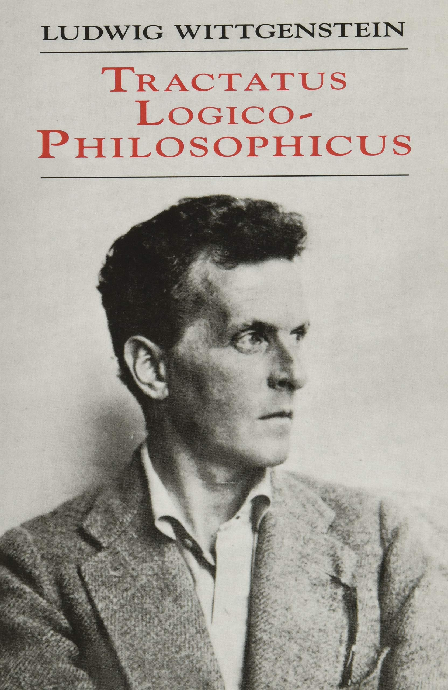
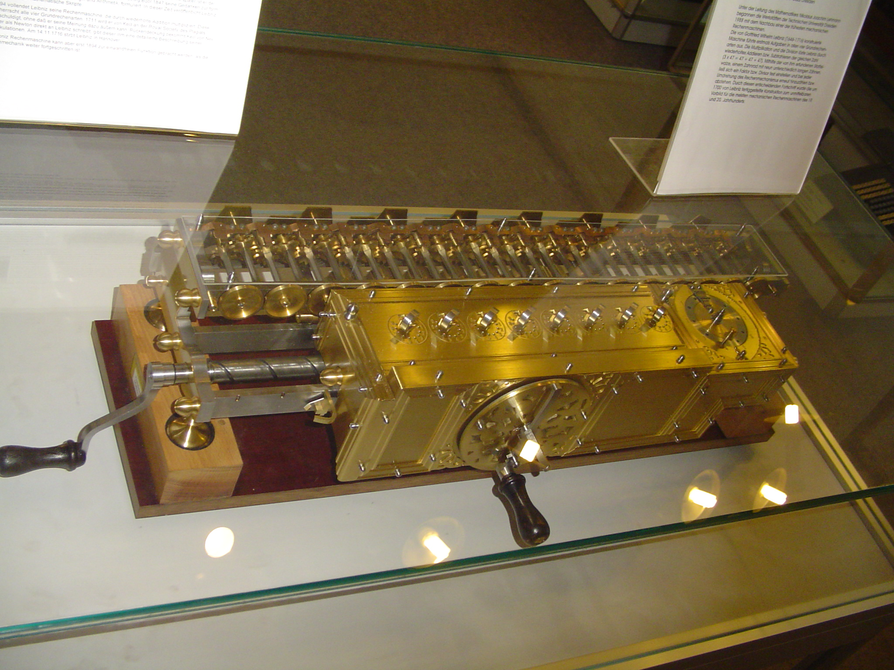
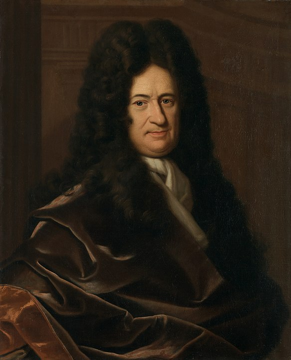
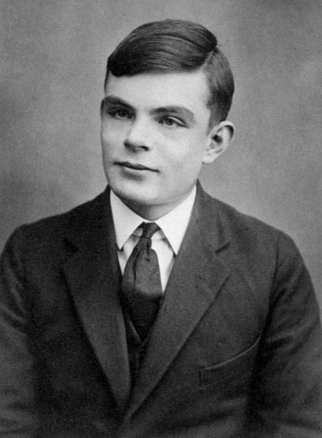
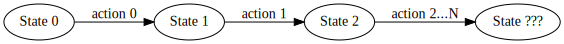
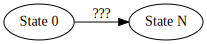

# Things you ~~must~~ should know as a <span style="color:green">good</span> software engineer

---

## Agenda
- The principle
- The formal language

---

## The principle
> What can be said at all can be said clearly; and whereof one cannot speak thereof one must be silent.
-- Ludwig Wittgenstein


<!-- Here should be a clear line between the known and the unknown. -->

---

## #0 Lambda Calculus

---

### Why Lambda Calculus?

---

### Leibniz Calculator

<!-- invented by the German mathematician Gottfried Wilhelm Leibniz around 1672 and completed in 1694. -->

---

#### Entscheidungsproblem - Decision problem
- A machine that could manipulate symbols in order to **determine the truth values** of mathematical statements.

The first step would have to be a clean **formal language**


---

In 1936, Alonzo Church and Alan Turing published independent papers showing that a general solution to the Entscheidungsproblem is impossible.


<!-- -->

---

### DEFINITION

(i) *Lambda terms* are words over the following alphabet:
|||
|---|---|
|$v_0, v_1, ...$|variables,|
|$\lambda$|abstractor,|
|$(, )$|parentheses.|

(ii) The set of $\lambda$-terms $\Lambda$ is defined inductively* as follows:
(1) $x \in \Lambda ;$
(2) $M \in \Lambda \implies (\lambda x M) \in \Lambda ;$
(3) $M, N \in \Lambda \implies (M N) \in \Lambda;$
where $x$ in (1) or (2) is an arbitrary variable.

---

$$
\textbf{There is no clear boundaries} \\
\textbf{between data, computation, programming languages and programming paradigms.}
$$

---

### Example: If statement and $\beta$-reduction
$TRUE=\lambda x . \lambda y . x$
$FALSE=\lambda x . \lambda y . y$
$IF=\lambda p . \lambda a . \lambda b . p\ a\ b$

$$
\begin{align*}
IF\quad TRUE\quad M\quad N &= \lambda p . \lambda a . \lambda b .\ p\ a\ b\quad TRUE\quad M\quad N \\
                           &= TRUE\quad M\quad N \\
                           &= \lambda x . \lambda y . x\quad M\quad N \\
                           &= M
\end{align*}
$$

---

### Example: Church Numerals

$c_0 = \lambda s. \lambda z. z;$
$c_1 = \lambda s. \lambda z.\ s\ z;$
$c_2 = \lambda s. \lambda z.\ s\ (s\ z);$
$c_3 = \lambda s. \lambda z.\ s\ (s\ (s\ z));$
$...$

$plus = \lambda m. \lambda n. \lambda s. \lambda z.\ m\ s\ (n\ s\ z)$
<!-- s: successor, z: zero -->

---

## #0.1 Try to create and use pure functions as many as possible

---

In computer programming, a pure function is a function that has the following properties:
1. the function return values are identical for identical arguments (no variation with local static variables, non-local variables, mutable reference arguments or input streams), and
2. the function application has no side effects (no mutation of local static variables, non-local variables, mutable reference arguments or input/output streams).

---

$$AssertEquals(f(x), f(x))$$

---

## #1 Context matters

---

A variable $x$ occurs *free* in a $\lambda$-terms $M$ if $x$ is not in the scope of a $\lambda x$; $x$ occurs *bound* otherwise.

In $x (\lambda y.xy)$, $x$ occurs free and $y$ occurs bound.
In $y (\lambda y.y)$, $y$ occurs both free and bound.

---

## #2 Choose programming paradigm wisely

---

## [Programming paradigm](https://en.wikipedia.org/wiki/Programming_paradigm)

Common programming paradigms include:

- *imperative* in which the programmer **instructs** the machine how to change its state.


<!-- 
@startuml
digraph G {
rankdir="LR";
    "State 0" -> "State 1" [label="action 0"]
    "State 1" -> "State 2" [label="action 1"]
    "State 2" -> "State ???" [label="action 2...N"]
} 
@enduml
-->

- *declarative* in which the programmer merely **declares** properties of the desired result, but not how to compute it.


<!--
@startuml
digraph G {
rankdir="LR";
    "State 0" -> "State N" [label="???"]
} 
@enduml
 -->

---

### Imperative

- ***procedural*** which groups instructions into procedures,
- ***object-oriented*** which groups instructions with the part of the state they operate on,

---

### Declarative

- ***functional*** in which the desired result is declared as the value of a series of function applications,
- *logic* in which the desired result is declared as the answer to a question about a system of facts and rules,
- *mathematical* in which the desired result is declared as the solution of an optimization problem
- ***reactive*** in which the desired result is declared with data streams and the propagation of change

---

### Example

```go
func gcd(a, b int) int {
    for {
        if b == 0 {
            return a
        }
        t := b
        b := a % b
        a := t
    }
}
```

```go
func gcd(a, b int) int {
    if b == 0 {
        return a
    }
    return gcd(b, a % b)
}
```

---

$$ Thanks! \\ Q \& A $$

---

<!-- 
## #3 Semantics matters

--- -->

## References

“Conversion.” *The Lambda Calculus: Its Syntax and Semantics*, College Publications, 2012.
“The Untyped Lambda-Calculus.” *Types and Programming Languages*, by Benjamin C. Pierce, The MIT Press, 2002. 

---

## Wiki
[Foundations of mathematics - Wikipedia](https://en.wikipedia.org/wiki/Foundations_of_mathematics)
[Alonzo Church - Wikipedia](https://en.wikipedia.org/wiki/Alonzo_Church)
[Alan Turing - Wikipedia](https://en.wikipedia.org/wiki/Alan_Turing)
[Lambda calculus - Wikipedia](https://en.wikipedia.org/wiki/Lambda_calculus)
[Tractatus Logico-Philosophicus - Wikipedia](https://en.wikipedia.org/wiki/Tractatus_Logico-Philosophicus)
[Gottfried Wilhelm Leibniz - Wikipedia](https://en.wikipedia.org/wiki/Gottfried_Wilhelm_Leibniz)

---

[Presentation](../assets/2022-04-09-computing.html)